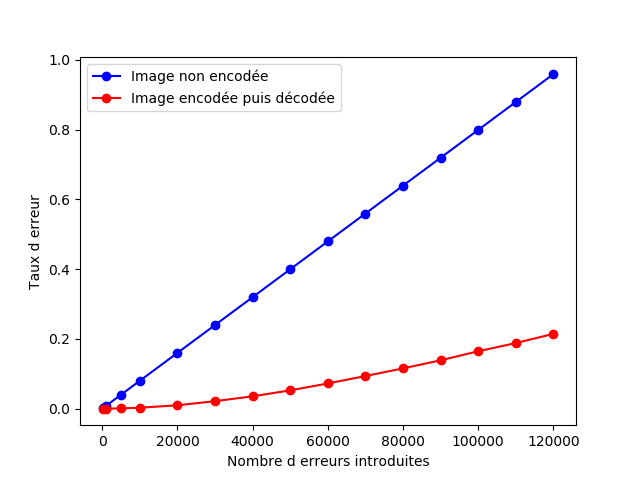
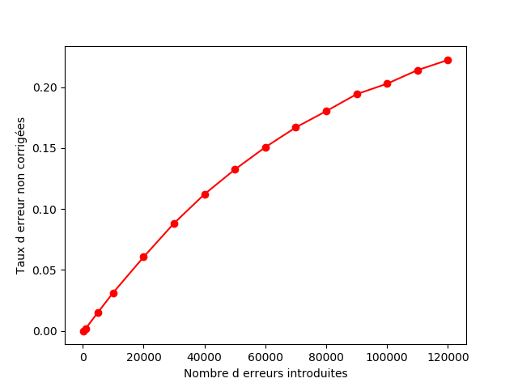
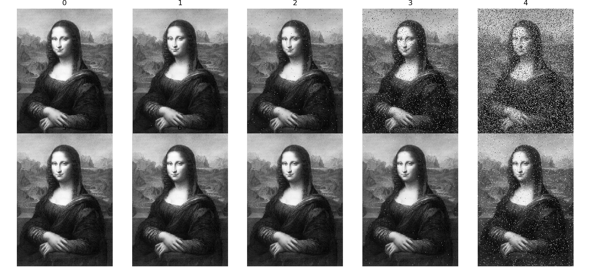
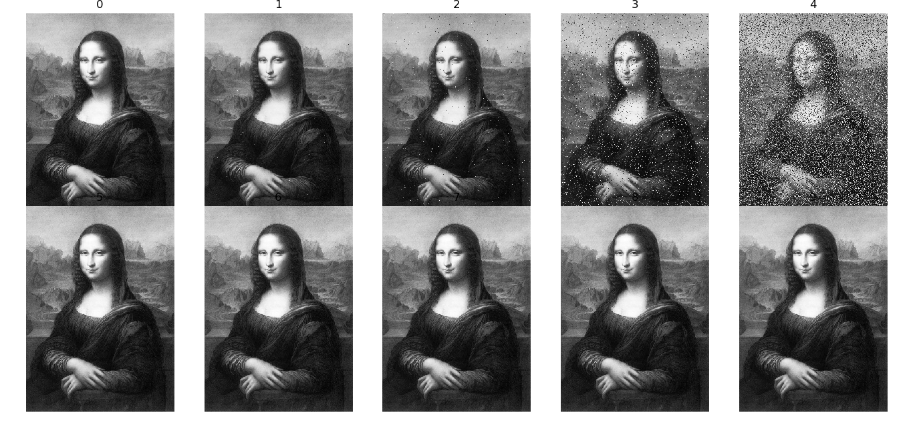

# Reed-Muller Code Experiments

This project explores image transmission with Reed-Muller error-correcting codes, with a focus on:

- `RM(2,3)` in `src/rm23.py`
- `RM(2,4)` in `src/rm24.py`

The scripts encode grayscale image data, inject errors, decode, and display visual comparisons.

## Project Structure

- `src/core.py`: shared Reed-Muller/math helpers
- `src/image.py`: shared image helpers and localized bit-error injection
- `src/rm23.py`: pipeline and demo for `RM(2,3)`
- `src/rm24.py`: pipeline and demo for `RM(2,4)`
- `src/stats.py`: plotting/statistics helper script
- `data/`: input image used by the demos (`joconde.jpg`)
- `docs/`: references and project deliverables, including:
  - `presentation-oral.pdf`
  - `presentation-written.pdf`

## Requirements

- Python 3.10+ (tested with Python 3.12)
- Dependencies listed in `requirements.txt`:
  - `numpy`
  - `matplotlib`

Install dependencies:

```bash
pip install -r requirements.txt
```

## Run

From the project root:

```bash
python src/rm23.py
python src/rm24.py
```

## Results

The generated outputs are available in `outputs/`:

### Statistics

- `outputs/stats/error_rate.png`
- `outputs/stats/uncorrected_error_rate.png`




### Image reconstruction comparison

- `outputs/image/error_correction_capacity_non_optimized.png`
- `outputs/image/error_correction_capacity_optimized.png`





